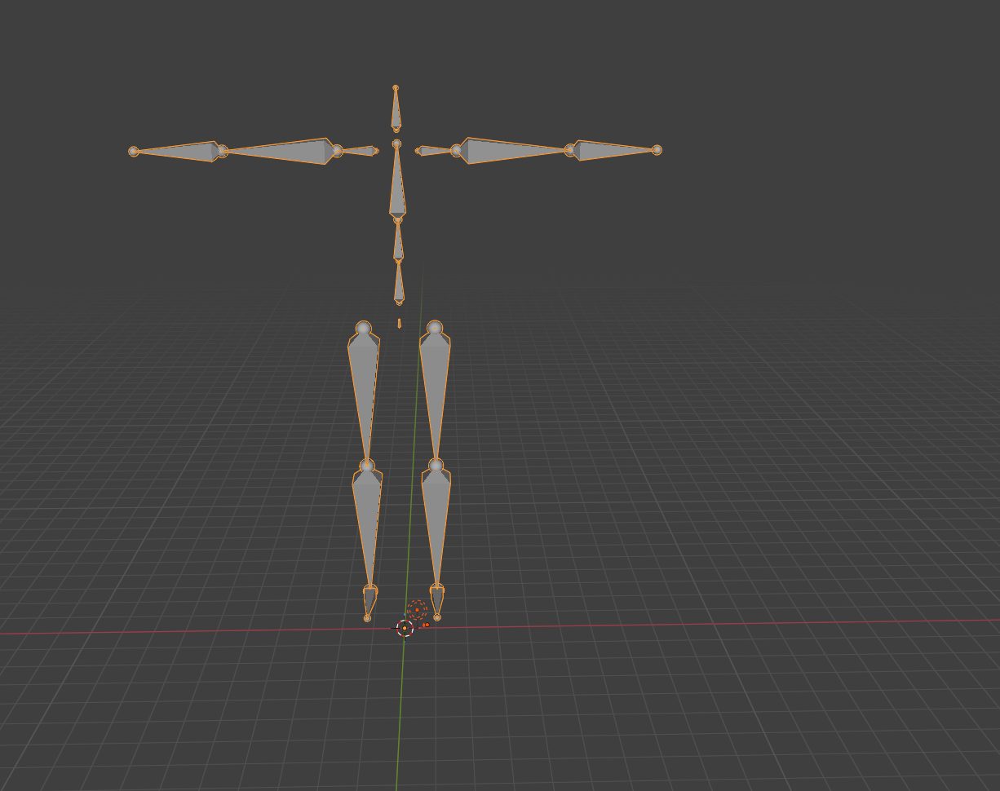

# GMR: General Motion Retargeting

  <a href="https://arxiv.org/abs/2505.02833">
    
  </a> <a href="https://arxiv.org/abs/2510.02252">
    
  </a> <a href="https://opensource.org/licenses/MIT">
    
  </a> <a href="https://github.com/YanjieZe/GMR/releases">
    
  </a> <a href="https://x.com/ZeYanjie/status/1952446745696469334">
    
  </a> <a href="https://yanjieze.github.io/humanoid-foundation/#GMR">
    
  </a> <a href="https://www.bilibili.com/video/BV1p1nazeEzC/?share_source=copy_web&vd_source=c76e3ab14ac3f7219a9006b96b4b0f76">
    
  </a>


This repository is forked from [GMR](https://github.com/YanjieZe/GMR)

This repository has been modified to add \
*IK-CONFIG auto-generation* from [GMR_autoik](https://github.com/HUST-3W/GMR_autoik) \
*Dataset Slicing* \
function for your own humanoid robots.

## Supported Robots and Data Formats in this repository

| Assigned ID | Robot/Data Format | Robot DoF | SMPLX ([AMASS](https://amass.is.tue.mpg.de/), [OMOMO](https://github.com/lijiaman/omomo_release)) | BVH [LAFAN1](https://github.com/ubisoft/ubisoft-laforge-animation-dataset)| FBX ([OptiTrack](https://www.optitrack.com/)) |  BVH [Nokov](https://www.nokov.com/) | PICO ([XRoboToolkit](https://github.com/XR-Robotics/XRoboToolkit-PC-Service)) | More formats coming soon | 
| --- | --- | --- | --- | --- | --- | --- | --- | --- |
| 0 | Unitree G1 `unitree_g1` | Leg (2\*6) + Waist (3) + Arm (2\*7) = 29 | ✅ | ✅ | ✅ |  ✅ | ✅ |
| 1 | Unitree G1 with Hands `unitree_g1_with_hands` | Leg (2\*6) + Waist (3) + Arm (2\*7) + Hand (2\*7) = 43 | ✅ | ✅ | ✅ | TBD | TBD |
| 2 | Roboparty `Origin` | Leg (2\*6) + Waist (1) + Arm (2\*5) = 23 | ✅ | TBD | TBD | TBD | TBD |


## Installation

> [!NOTE]
> The code is tested on Ubuntu 22.04/20.04.

First create your conda environment:

```bash
conda create -n gmr python=3.10 -y
conda activate gmr
```

Then, install GMR:

```bash
pip install -e .
```

After installing SMPLX, change `ext` in `smplx/body_models.py` from `npz` to `pkl` if you are using SMPL-X pkl files.

And to resolve some possible rendering issues:

```bash
conda install -c conda-forge libstdcxx-ng -y
```

## Data Preparation

[[SMPLX](https://github.com/vchoutas/smplx) body model] download SMPL-X body models to `assets/body_models` from [SMPL-X](https://smpl-x.is.tue.mpg.de/) and then structure as follows:
```bash
- assets/body_models/smplx/
-- SMPLX_NEUTRAL.pkl
-- SMPLX_FEMALE.pkl
-- SMPLX_MALE.pkl
```

[[AMASS](https://amass.is.tue.mpg.de/) motion data] download raw SMPL-X data to any folder you want from [AMASS](https://amass.is.tue.mpg.de/). NOTE: Do not download SMPL+H data.

[[OMOMO](https://github.com/lijiaman/omomo_release) motion data] download raw OMOMO data to any folder you want from [this google drive file](https://drive.google.com/file/d/1tZVqLB7II0whI-Qjz-z-AU3ponSEyAmm/view?usp=sharing). And process the data into the SMPL-X format using `scripts/convert_omomo_to_smplx.py`.

[[LAFAN1](https://github.com/ubisoft/ubisoft-laforge-animation-dataset) motion data] download raw LAFAN1 bvh files from [the official repo](https://github.com/ubisoft/ubisoft-laforge-animation-dataset), i.e., [lafan1.zip](https://github.com/ubisoft/ubisoft-laforge-animation-dataset/blob/master/lafan1/lafan1.zip).


## Human/Robot Motion Data Formulation

To better use this library, you can first have an understanding of the human motion data we use and the robot motion data we obtain.

Each frame of **human motion data** is formulated as a dict of (human_body_name, 3d global translation + global rotation). The rotation is usually represented as quaternion (with wxyz order by default, to align with mujoco).

Each frame of **robot motion data** can be understood as a tuple of (robot_base_translation, robot_base_rotation, robot_joint_positions).

## Usage

### Robot IK_CONFIG Automatic Generation
This function is implemented in the ik_config_manager folder to generate optimized *human_scale* and *pos/quat_offset* parameters.

1. Add a {robot}_tpose.json file in the pose_inits folder (to set the robot's initial pose to T-pose).
2. Add the bvh/smplx_to_robot_origin.json file to the ik_configs folder (primarily requiring joint_match to fully align the humanoid robot with human_data in T-pose).



3. Then,

For BVH Format：
```bash
python ik_config_manager/generate_keypoint_mapping_bvh.py \
    --bvh_file ik_config_manager/TPOSE.bvh \
    --robot unitree_g1 \
    --loop \
    --robot_qpos_init ik_config_manager/pose_inits/unitree_g1_tpose.json \
    --ik_config_in general_motion_retargeting/ik_configs/bvh_lafan1_to_g1.json \
    --ik_config_out general_motion_retargeting/ik_configs/bvh_lafan1_to_g1_auto.json
```

For SMPLX Format：
```bash
python ik_config_manager/generate_keypoint_mapping_smplx.py \
    --smplx_file ik_config_manager/SMPLX_TPOSE_UNIFIED_AMASS.npz \
    --robot unitree_g1 \
    --loop \
    --robot_qpos_init ik_config_manager/pose_inits/unitree_g1_tpose.json \
    --ik_config_in general_motion_retargeting/ik_configs/smplx_to_g1.json \
    --ik_config_out general_motion_retargeting/ik_configs/smplx_to_g1_auto.json
```

### Dataset Slicing
This function is added in `smplx_to_robot.py`, `bvh_to_robot.py`, `gvhmr_to_robot.py` to obtain dataset slices.

To use this feature, please set `--save_slice` to `True` and manully set start and end frame using `--slice_motion_start_end`.


### Dataset Format
For AMP, pleased set `--save_as_pkl` to `True` to save dataset with `.pkl`.

For BeyondMimic, pleased set `--save_as_csv` to `True` to save dataset with `.csv`.


### Retargeting from SMPL-X (AMASS, OMOMO) to Robot

Retarget a single motion:

```bash
python scripts/smplx_to_robot.py --smplx_file <path_to_smplx_data> --robot <path_to_robot_data> --save_path <path_to_save_robot_data.pkl> --rate_limit
```

By default you should see the visualization of the retargeted robot motion in a mujoco window.
If you want to record video, add `--record_video` and `--video_path <your_video_path,mp4>`.

- `--rate_limit` is used to limit the rate of the retargeted robot motion to keep the same as the human motion. If you want it as fast as possible, remove `--rate_limit`.

Retarget a folder of motions:

```bash
python scripts/smplx_to_robot_dataset.py --src_folder <path_to_dir_of_smplx_data> --tgt_folder <path_to_dir_to_save_robot_data> --robot <robot_name>
```

By default there is no visualization for batch retargeting.

### Retargeting from GVHMR to Robot

First, install GVHMR by following [their official instructions](https://github.com/zju3dv/GVHMR/blob/main/docs/INSTALL.md).

And run their demo that can extract human pose from monocular video:

```bash
cd path/to/GVHMR
python tools/demo/demo.py --video=docs/example_video/tennis.mp4 -s
```

Then you should obtain the saved human pose data in `GVHMR/outputs/demo/tennis/hmr4d_results.pt`.

Then, run the command below to retarget the extracted human pose data to your robot:

```bash
python scripts/gvhmr_to_robot.py --gvhmr_pred_file <path_to_hmr4d_results.pt> --robot unitree_g1 --record_video
```


## Retargeting from BVH (LAFAN1, Nokov) to Robot

Retarget a single motion:

```bash
# single motion
python scripts/bvh_to_robot.py --bvh_file <path_to_bvh_data> --robot <path_to_robot_data> --save_path <path_to_save_robot_data.pkl> --rate_limit --format <format>
```

By default you should see the visualization of the retargeted robot motion in a mujoco window. 
- `--rate_limit` is used to limit the rate of the retargeted robot motion to keep the same as the human motion. If you want it as fast as possible, remove `--rate_limit`.
- `--format` is used to specify the format of the BVH data. Supported formats are `lafan1` and `nokov`.


Retarget a folder of motions:

```bash
python scripts/bvh_to_robot_dataset.py --src_folder <path_to_dir_of_bvh_data> --tgt_folder <path_to_dir_to_save_robot_data> --robot <robot_name>
```

By default there is no visualization for batch retargeting.


### Retargeting from FBX (OptiTrack) to Robot

#### Offline FBX Files

Retarget a single motion:

1. Install `fbx_sdk` by following [these instructions](https://github.com/nv-tlabs/ASE/tree/main/ase/poselib#importing-from-fbx) and [these instructions](https://github.com/nv-tlabs/ASE/issues/61#issuecomment-2670315114). You will probably need a new conda environment for this.

2. Activate the conda environment where you installed `fbx_sdk`.
Use the following command to extract motion data from your `.fbx` file:

```bash
cd third_party
python poselib/fbx_importer.py --input <path_to_fbx_file.fbx> --output <path_to_save_motion_data.pkl> --root-joint <root_joint_name> --fps <fps>
```

3. Then, run the command below to retarget the extracted motion data to your robot:

```bash
conda activate gmr
# single motion
python scripts/fbx_offline_to_robot.py --motion_file <path_to_saved_motion_data.pkl> --robot <path_to_robot_data> --save_path <path_to_save_robot_data.pkl> --rate_limit
```

By default you should see the visualization of the retargeted robot motion in a mujoco window. 

- `--rate_limit` is used to limit the rate of the retargeted robot motion to keep the same as the human motion. If you want it as fast as possible, remove `--rate_limit`.


### PICO Streaming to Robot (TWIST2)

Install PICO SDK:
1. On your PICO, install PICO SDK: see [here](https://github.com/XR-Robotics/XRoboToolkit-Unity-Client/releases/).
2. On your own PC, 
    - Download [deb package for ubuntu 22.04](https://github.com/XR-Robotics/XRoboToolkit-PC-Service/releases/download/v1.0.0/XRoboToolkit_PC_Service_1.0.0_ubuntu_22.04_amd64.deb), or build from the [repo source](https://github.com/XR-Robotics/XRoboToolkit-PC-Service).
    - To install, use command
        ```bash
        sudo dpkg -i XRoboToolkit_PC_Service_1.0.0_ubuntu_22.04_amd64.deb
        ```
        then you should see `xrobotoolkit-pc-service` in your APPs. remember to start this app before you do teleopperation.
    - Build PICO PC Service SDK and Python SDK for PICO streaming:
        ```bash
        conda activate gmr

        git clone https://github.com/YanjieZe/XRoboToolkit-PC-Service-Pybind.git
        cd XRoboToolkit-PC-Service-Pybind

        mkdir -p tmp
        cd tmp
        git clone https://github.com/XR-Robotics/XRoboToolkit-PC-Service.git
        cd XRoboToolkit-PC-Service/RoboticsService/PXREARobotSDK 
        bash build.sh
        cd ../../../..
        

        mkdir -p lib
        mkdir -p include
        cp tmp/XRoboToolkit-PC-Service/RoboticsService/PXREARobotSDK/PXREARobotSDK.h include/
        cp -r tmp/XRoboToolkit-PC-Service/RoboticsService/PXREARobotSDK/nlohmann include/nlohmann/
        cp tmp/XRoboToolkit-PC-Service/RoboticsService/PXREARobotSDK/build/libPXREARobotSDK.so lib/
        # rm -rf tmp

        # Build the project
        conda install -c conda-forge pybind11
        pip uninstall -y xrobotoolkit_sdk
        python setup.py install
        ```

You should be all set!

To try it, check [this script from TWIST2](https://github.com/amazon-far/TWIST2/blob/master/teleop.sh):
```bash
bash teleop.sh
```
You should be able to see the retargeted robot motion in a mujoco window.


#### Online Streaming

We provide the script to use OptiTrack MoCap data for real-time streaming and retargeting.

Usually you will have two computers, one is the server that installed with Motive (Desktop APP for OptiTrack) and the other is the client that installed with GMR.

Find the server ip (the computer that installed with Motive) and client ip (your computer). Set the streaming as follows:


And then run:

```bash
python scripts/optitrack_to_robot.py --server_ip <server_ip> --client_ip <client_ip> --use_multicast False --robot unitree_g1
```

You should see the visualization of the retargeted robot motion in a mujoco window.

### Visualize saved robot motion

Visualize a single motions:

```bash
python scripts/vis_robot_motion.py --robot <robot_name> --robot_motion_path <path_to_save_robot_data.pkl>
```

If you want to record video, add `--record_video` and `--video_path <your_video_path,mp4>`.

Visualize a folder of motions:

```bash
python scripts/vis_robot_motion_dataset.py --robot <robot_name> --robot_motion_folder <path_to_save_robot_data_folder>
```

After launching the MuJoCo visualization window and clicking on it, you can use the following keyboard controls::
* `[`: play the previous motion
* `]`: play the next motion
* `space`: toggle play/pause

## Speed Benchmark

| CPU | Retargeting Speed |
| --- | --- |
| AMD Ryzen Threadripper 7960X 24-Cores | 60~70 FPS |
| 13th Gen Intel Core i9-13900K 24-Cores | 35~45 FPS |
| TBD | TBD |

## Citation

If you find our code useful, please consider citing our related papers:

```bibtex
@article{joao2025gmr,
  title={Retargeting Matters: General Motion Retargeting for Humanoid Motion Tracking},
  author= {Joao Pedro Araujo and Yanjie Ze and Pei Xu and Jiajun Wu and C. Karen Liu},
  year= {2025},
  journal= {arXiv preprint arXiv:2510.02252}
}
```

```bibtex
@article{ze2025twist,
  title={TWIST: Teleoperated Whole-Body Imitation System},
  author= {Yanjie Ze and Zixuan Chen and João Pedro Araújo and Zi-ang Cao and Xue Bin Peng and Jiajun Wu and C. Karen Liu},
  year= {2025},
  journal= {arXiv preprint arXiv:2505.02833}
}
```

and this github repo:

```bibtex
@software{ze2025gmr,
  title={GMR: General Motion Retargeting},
  author= {Yanjie Ze and João Pedro Araújo and Jiajun Wu and C. Karen Liu},
  year= {2025},
  url= {https://github.com/YanjieZe/GMR},
  note= {GitHub repository}
}
```

## Known Issues

Designing a single config for all different humans is not trivial. We observe some motions might have bad retargeting results. If you observe some bad results, please let us know! We now have a collection of such motions in [TEST_MOTIONS.md](TEST_MOTIONS.md).

## Acknowledgement

[GMR: General Motion Retargeting](https://github.com/YanjieZe/GMR): MIT license

[GMR: General Motion Retargeting(Fork for IK-CONFIG auto-generation)](https://github.com/HUST-3W/GMR_autoik): MIT license

Our IK solver is built upon [mink](https://github.com/kevinzakka/mink) and [mujoco](https://github.com/google-deepmind/mujoco). 

Our visualization is built upon [mujoco](https://github.com/google-deepmind/mujoco). 

The human motion data we try includes [AMASS](https://amass.is.tue.mpg.de/), [OMOMO](https://github.com/lijiaman/omomo_release), and [LAFAN1](https://github.com/ubisoft/ubisoft-laforge-animation-dataset).

The original robot models can be found at the following locations:

* [Roboparty Origin](https://github.com/Roboparty/rpo_description)
* [Unitree G1](https://github.com/unitreerobotics/unitree_ros): [Link to file](https://github.com/unitreerobotics/unitree_ros/tree/master/robots/g1_description)
